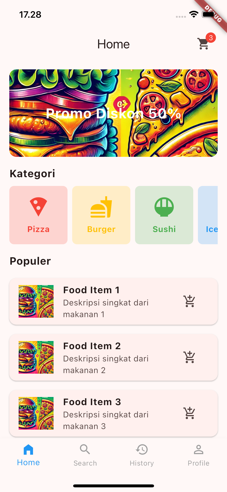

# My App - Aplikasi Pemesanan Makanan

Selamat datang di **My App**, sebuah proyek Flutter yang dirancang untuk menampilkan aplikasi pemesanan makanan. Aplikasi ini memungkinkan pengguna untuk menjelajahi menu makanan, melihat detail item, dan melakukan pemesanan. Antarmuka pengguna dan fungsionalitasnya dirancang untuk memberikan pengalaman pemesanan makanan yang efisien dan menyenangkan.

## 📱 Tampilan Aplikasi


*Halaman Utama Aplikasi*

## Fitur Utama

* **Jelajahi Menu Makanan**: Lihat daftar makanan lengkap dengan harga, kategori, dan deskripsi
* **Detail Makanan**: Akses informasi lengkap tentang setiap item makanan, termasuk gambar
* **Fungsi Pemesanan**: Tambahkan item ke pesanan dengan kemampuan mengatur jumlah
* **Profil Pengguna**: Bagian profil dengan opsi untuk mengelola detail pribadi, preferensi, dan riwayat pesanan
* **Notifikasi**: Terima pembaruan status pesanan

## Contoh Tampilan Fitur

<div style="display: flex; justify-content: space-between;">
    
    
    
</div>

## Memulai

Petunjuk berikut akan membantu Anda menyiapkan dan menjalankan proyek di komputer lokal Anda.

### Prasyarat

* **Flutter SDK**: Pastikan Flutter sudah terinstal di lingkungan pengembangan Anda
* **IDE**: IDE yang direkomendasikan adalah Android Studio atau Visual Studio Code dengan plugin Flutter dan Dart

### Instalasi

1. **Clone Repository**:
```bash
git clone https://github.com/yourusername/my_app.git
```

2. **Masuk ke Direktori Proyek**:
```bash
cd my_app
```

3. **Instal Dependensi**:
```bash
flutter pub get
```

4. **Jalankan Aplikasi**:
   * Hubungkan perangkat atau mulai emulator
   * Jalankan:
```bash
flutter run
```

## Struktur Proyek

* **lib/**: Berisi kode aplikasi utama termasuk model, screen, dan widget
* **assets/images/**: Menyimpan gambar untuk item makanan dan elemen UI

## Aset

Tempatkan semua gambar terkait aplikasi di folder `assets/images`. Pastikan path diperbarui di `pubspec.yaml`:

```yaml
flutter:
  assets:
    - assets/images/
```

## 📱 Fitur yang Akan Datang

- [ ] Integrasi pembayaran online
- [ ] Sistem review dan rating
- [ ] Fitur chat dengan restoran
- [ ] Pelacakan pesanan real-time
- [ ] Program loyalitas pelanggan

## Tampilan Responsif

Aplikasi ini dirancang untuk bekerja dengan baik di berbagai ukuran layar:

| Mobile | Tablet | Desktop |
|--------|--------|---------|
|  |  |  |

## Bantuan

Untuk bantuan tambahan atau jika Anda mengalami masalah, silakan merujuk ke dokumentasi Flutter yang menyediakan panduan lengkap tentang pengembangan Flutter.

## Kontribusi

Kami sangat menghargai kontribusi Anda! Jika Anda ingin berkontribusi pada proyek ini, silakan:

1. Fork repository
2. Buat branch fitur baru (`git checkout -b fitur-baru`)
3. Commit perubahan Anda (`git commit -m 'Menambahkan fitur baru'`)
4. Push ke branch (`git push origin fitur-baru`)
5. Buat Pull Request

## Lisensi

Proyek ini dilisensikan di bawah Lisensi MIT - lihat file [LICENSE.md](LICENSE.md) untuk detail.

---

Dibuat dengan ❤️ menggunakan Flutter